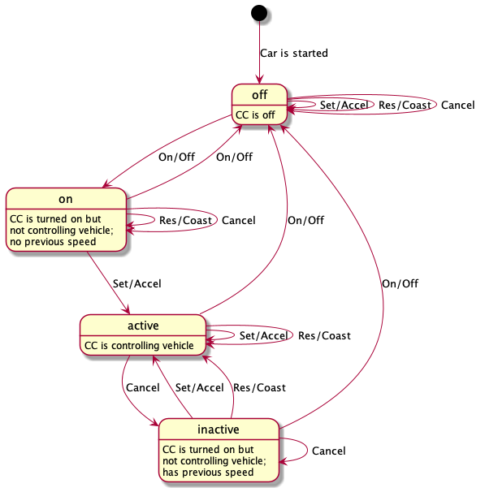

# Cruise Control

This project was created as a demonstration of the concepts of a
[finite state machine](https://en.wikipedia.org/wiki/Finite-state_machine).

## Inputs

The cruise control system represented here has four buttons:

* On/Off
* Set/Accel — set the current speed or accelerate
* Res/Coast — resume the previously set speed or decelerate
* Cancel

The brake pedal (and clutch pedal) can be considered a cancel button.

## States

The finite state machine has four states:

* Off — initial state; no inputs taken
* On — CC is turned on but is not controlling vehicle; no previous speed
* Active — CC is controlling vehicle
* Inactive — CC is turned on but is not controlling vehicle; has previous speed

## Actions and Transitions

As a finite state machine, each input has a corresponding output and state
transition, based on the current state. The _output_ is shown in italics. A
transition to a new state is shown as ➡&nbsp;**Next**, and remaining in the
current state is shown as ↩&nbsp;**Current**.

Current State > Input v | Off | On | Inactive | Active
----------------------------|-----|----|----------|--------
On/Off    | _none_ ➡ **On**  | _none_ ➡ **Off** | _none_ ➡ **Off** | _release vehicle_ ➡ **Off**
Set/Accel | _none_ ↩ **Off** | _engage CC at current speed_ ➡ **Active** | _engage CC at current speed_ ➡ **Active** | _increase speed_ ↩ **Active**
Res/Coast | _none_ ↩ **Off** | _none_ ↩ **On**  | _engage CC at previous speed_ ➡ **Active** | _decrease speed_ ↩ **Active**
Cancel    | _none_ ↩ **Off** | _none_ ↩ **On**  | _none_ ↩ **Inactive** | _release vehicle_ ➡ **Inactive**

Below is a chart representing the states, inputs and transitions. (The outputs are not shown.)

